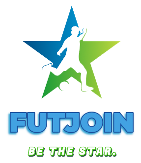

<div id="top"></div>

<!-- PROJECT SHIELDS -->
[![Contributors][contributors-shield]][contributors-url]
[![Forks][forks-shield]][forks-url]
[![Stargazers][stars-shield]][stars-url]
[![Issues][issues-shield]][issues-url]
[![MIT License][license-shield]][license-url]
[![LinkedIn][linkedin-shield]][linkedin-url]

<!-- PROJECT LOGO -->
<br />
<div align="center">
  <a href="https://github.com/jboned/FutJoin">
    
  </a>

<h3 align="center">FutJoin</h3>

  <p align="center">
    FutJoin is my end-of-degree project for The University of Malaga and introduces a web application which allows to schedule your own amateur football games, booking from a variety of football pitches across sporting centers in Malaga. 
    <br />
    <a href="https://github.com/jboned/FutJoin"><strong>Explore the docs »</strong></a>
    <br />
    <br />
    <a href="https://github.com/jboned/FutJoin">View Demo</a>
    ·
    <a href="https://github.com/jboned/FutJoin/issues">Report Bug</a>
    ·
    <a href="https://github.com/jboned/FutJoin/issues">Request Feature</a>
  </p>
</div>

<!-- TABLE OF CONTENTS -->
<details>
  <summary>Table of Contents</summary>
  <ol>
    <li>
      <a href="#about-the-project">About The Project</a>
      <ul>
        <li><a href="#built-with">Built With</a></li>
      </ul>
    </li>
    <li>
      <a href="#getting-started">Getting Started</a>
      <ul>
        <li><a href="#prerequisites">Prerequisites</a></li>
        <li><a href="#installation">Installation</a></li>
      </ul>
    </li>
    <li><a href="#usage">Usage</a></li>
    <li><a href="#roadmap">Roadmap</a></li>
    <li><a href="#contributing">Contributing</a></li>
    <li><a href="#license">License</a></li>
    <li><a href="#contact">Contact</a></li>
    <li><a href="#acknowledgments">Acknowledgments</a></li>
  </ol>
</details>


<!-- ABOUT THE PROJECT -->
## About The Project
This end-of-degree project introduces a web application which allows to schedule your own amateur football games, booking from a variety of football pitches across sporting centers in Malaga. The development of the app is characterised by the homogeneity of JavaScript, given expression in the MEAN stack, which is formed by technologies Mongo DB, Angular, Node.js and Express. This way, application users would be able to check for the schedule availability of the fields at all times and, through a neat and simple graphic interface, interact with each other to organise games and invite new players. Each user will enjoy of a profile in which his personal details are listed (name, email, date of birth), as well as his footballing details (stronger foot, position of play or height) that can be seen by other users. 

![Product Name Screen Shot][product-screenshot]

Furthermore, the sport centers that cooperate with the app will offer a list of all the  available pitches, along with their characteristics and timetables.

<p align="right">(<a href="#top">back to top</a>)</p>

### Built With

* [Node.js](https://nodejs.org/)
* [Angular](https://angular.io/)
* [Express](https://expressjs.com)
* [MongoDB](https://www.mongodb.com)

<p align="right">(<a href="#top">back to top</a>)</p>


<!-- GETTING STARTED -->
## Getting Started

### Prerequisites
* PC with operating system: macOS, Linux or Windows.
* MongoDB (https://docs.mongodb.com/manual/installation/)
* NodeJS (https://nodejs.org/es/download/)
* npm
  ```sh
  npm install npm@latest -g
  ```
* Angular 
  ```sh
  npm install -g @angular/cli
  ```

### Installation

1. Clone the repo
   ```sh
   git clone https://github.com/jboned/FutJoin.git
   ```
2. In the 'Backend' folder, install NPM packages:
   ```sh
   npm install
   ```
3. Start the Node JS Backend application:
    ```sh
   npm start
   ```
4. In the 'Frontend' folder, install NPM packages:
   ```sh
   npm install
   ```
5. Start the Angular Frontend application:
    ```sh
   npm init
   ```
IMPORTANT: For the correct functioning of the client, once the command has been executed, copy and paste the "ngx-carousel-3d" folder into the "node_modules" folder created in the "Frontend" folder

<p align="right">(<a href="#top">back to top</a>)</p>


<!-- USAGE EXAMPLES -->
## Usage

### Login
On the login screen you will find the application's logo and the login form, along with the options to register in the application and to contact the  the login form, along with the options to register in the application and to contact the application in case the user is a sports center.

![Product Name Screen Shot][login-screenshot]

### Home
On the login screen you will find the application's logo and the login form, along with the options to register in the application and to contact the  the login form, along with the options to register in the application and to contact the application in case the user is a sports center.

![Product Name Screen Shot][home-screenshot]

### Sports centers
This menu will show the different sports complexes that collaborate with the application and that the user can access to organize a soccer match. Each sports center will have different football fields available for reservation.

![Product Name Screen Shot][sports-center-screenshot]

### Matches
Each football field has a personalised schedule with the free hours and app users can book the pitch and invite other app users. Users can choose whether they want to have a private match or free registration.

![Product Name Screen Shot][match-screenshot]


<p align="right">(<a href="#top">back to top</a>)</p>


<!-- ROADMAP -->
## Roadmap

- [x] Users
    - [x] Login/Logout
    - [x] Register
    - [x] Profile
    - [x] Hashing passwords
- [x] Sports center 
    - [x] Create new sport center in the app.
    - [x] Delete an existent sport center
    - [x] Carousel with sport centers. (for users)
- [x] Fotball fields
    - [x] Create/Delete/Update fields (for Sports centers)
    - [x] List of Fields of Sport Center (for users)
    - [x] Custom schedule for each Sport Center
- [x] Matches
    - [x] Create/Delete public/private Match
    - [x] Join to public match
    - [x] Invite other players (users)
    - [x] Join to private match (with invitation)
    - [x] Change private match to public.

See the [open issues](https://github.com/jboned/FutJoin/issues) for a full list of proposed features (and known issues).

<p align="right">(<a href="#top">back to top</a>)</p>

<!-- CONTRIBUTING -->
## Contributing

Contributions are what make the open source community such an amazing place to learn, inspire, and create. Any contributions you make are **greatly appreciated**.

If you have a suggestion that would make this better, please fork the repo and create a pull request. You can also simply open an issue with the tag "enhancement".
Don't forget to give the project a star! Thanks again!

1. Fork the Project
2. Create your Feature Branch (`git checkout -b feature/AmazingFeature`)
3. Commit your Changes (`git commit -m 'Add some AmazingFeature'`)
4. Push to the Branch (`git push origin feature/AmazingFeature`)
5. Open a Pull Request

<p align="right">(<a href="#top">back to top</a>)</p>

<!-- LICENSE -->
## License

Distributed under the MIT License. See `LICENSE.txt` for more information.

<p align="right">(<a href="#top">back to top</a>)</p>


<!-- CONTACT -->
## Contact

Javier Boned López - [![LinkedIn][linkedin-shield]][linkedin-url]

Project Link: [https://github.com/jboned/FutJoin](https://github.com/jboned/FutJoin)

<p align="right">(<a href="#top">back to top</a>)</p>


<!-- ACKNOWLEDGMENTS -->
## Acknowledgments

* [Bcrypt for hashing passwords](https://www.npmjs.com/package/bcrypt)
* [Img Shields](https://shields.io)
* [GitHub Pages](https://pages.github.com)
* [JSON Web Tokens](https://jwt.io/)
* [MagicDraw for Modelling Software](https://www.3ds.com/products-services/catia/products/no-magic/solutions/software-engineering/)

<p align="right">(<a href="#top">back to top</a>)</p>


<!-- MARKDOWN LINKS & IMAGES -->
<!-- https://www.markdownguide.org/basic-syntax/#reference-style-links -->
[contributors-shield]: https://img.shields.io/github/contributors/jboned/FutJoin.svg?style=for-the-badge
[contributors-url]: https://github.com/jboned/FutJoin/graphs/contributors
[forks-shield]: https://img.shields.io/github/forks/jboned/FutJoin.svg?style=for-the-badge
[forks-url]: https://github.com/jboned/FutJoin/network/members
[stars-shield]: https://img.shields.io/github/stars/jboned/FutJoin.svg?style=for-the-badge
[stars-url]: https://github.com/jboned/FutJoin/stargazers
[issues-shield]: https://img.shields.io/github/issues/jboned/FutJoin.svg?style=for-the-badge
[issues-url]: https://github.com/jboned/FutJoin/issues
[license-shield]: https://img.shields.io/github/license/jboned/FutJoin.svg?style=for-the-badge
[license-url]: https://github.com/jboned/FutJoin/blob/master/LICENSE.txt
[linkedin-shield]: https://img.shields.io/badge/-LinkedIn-black.svg?style=for-the-badge&logo=linkedin&colorB=555
[linkedin-url]: https://linkedin.com/in/javier-boned-lopez/
[product-screenshot]: images/app.png
[home-screenshot]: images/home.png
[sports-center-screenshot]: images/sports-center.png
[login-screenshot]: images/login.png
[match-screenshot]: images/match.png
